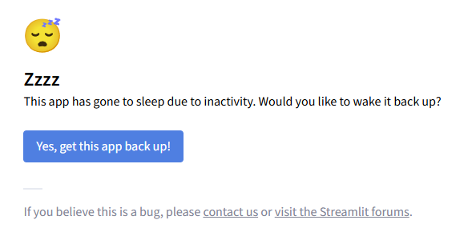
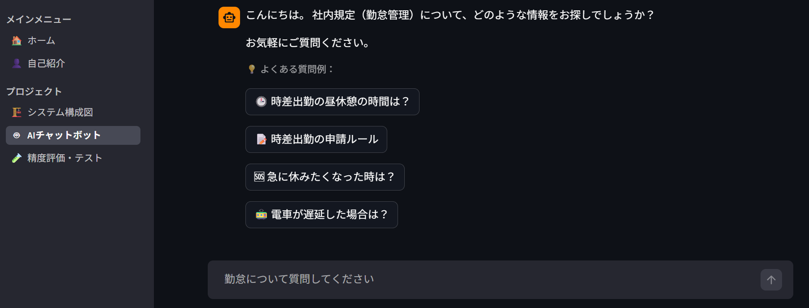
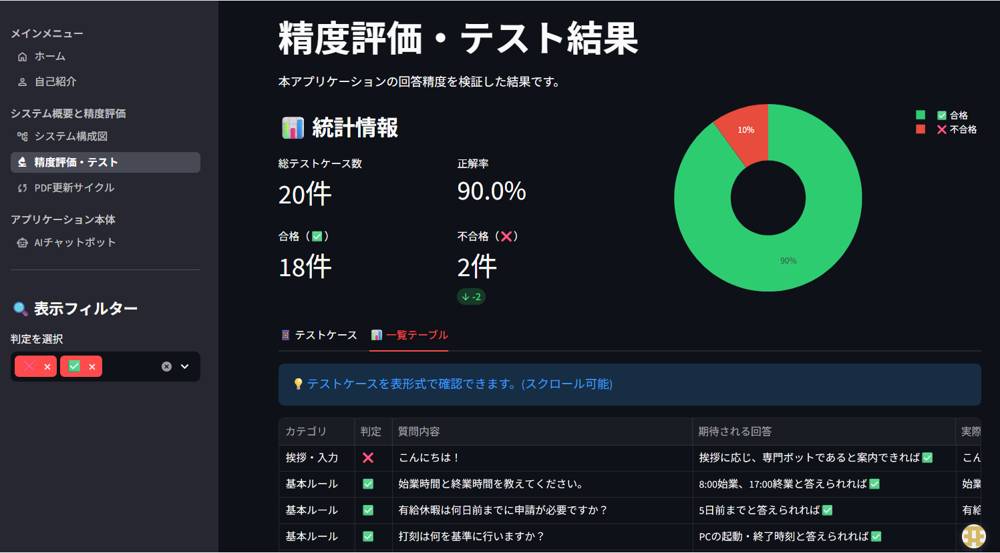
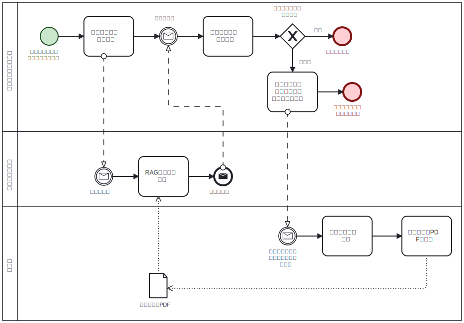

# 勤怠管理Q&Aチャットボット

Gemini API を活用し、社内規定（PDF）に基づいた正確な回答を生成するQ&Aチャットボットです。
実務での運用を想定し、「回答精度の可視化」と「PDF更新による継続的な改善サイクル」を意識してこのポートフォリオの開発しました。

## URL
[https://myportfolio-fujio-chatbot.streamlit.app/]
 [https://myportfolio-fujio-chatbot.streamlit.app/](https://myportfolio-fujio-chatbot.streamlit.app/)
* どなたでもブラウザから動作を確認いただけます。
* レスポンシブデザイン設計のため、モバイル端末でも閲覧できます。

> [注意]
> ### ℹ️ URLに遷移したときこの画面が出るとき
> 
> - Streamlit Cloud の無料枠を利用しているため、**数日間アクセスがない場合、自動的にスリープ状態**に入ります。
> - 【対応方法】下記の画面が表示された場合は、**[Yes, get this app back up] ボタン**をクリックしてください。1分ほどでアプリが再起動し、正常に閲覧可能になります。
> ### ℹ️ データについて
> - 使用している勤怠管理PDFおよびテストケース（CSV）は、ポートフォリオ公開用に独自に作成した架空のデータです。
> - 実在の組織や機密情報とは一切関係ありません。
> ### ℹ️ 実務で使用する場合
> 企業のセキュリティ要件に適合させるため、以下の構成を推奨しています。
> - Gemini APIを使用してGeminiに学習されるのを防ぐために「Vertex AI からGemini APIを取得」
> - 「勤怠ルールPDF」を社外秘にするために、Cloud Storageにて保管

## 動作イメージ
### チャット画面


### 精度評価ダッシュボード


## 業務プロセスと改善サイクル

「AIが回答して終わり」ではなく、解決しなかった質問を申請フォームから送信されることで管理者が修正し、規定（PDF）をアップデートすることで回答精度を継続的に向上させる**運用サイクル**を想定して設計しています。



## セットアップ方法

ローカル環境で実行する場合は以下の手順に従ってください。

1. リポジトリをクローン
2. 仮想環境の作成とライブラリのインストール
   ```bash
   python -m venv venv
   source venv/bin/activate  # Windowsの場合は venv\Scripts\activate
   pip install -r requirements.txt
   ```
3. `.streamlit/secrets.toml` を作成し、Gemini APIキーを設定
4. アプリケーションの起動
   ```bash
   streamlit run main.py
   ```

## 主な機能
* **RAG 実装**: PDF 資料（勤怠ルール）から関連情報を抽出し、根拠に基づいた回答を生成。
* **精度評価ダッシュボード**: テストケース 20 件による自動評価を行い、合格率を円グラフで可視化。
* **判定フィルター**: 「不合格」ケースのみを抽出して確認できるデバッグ用インターフェースを実装。

## 精度検証の結果
今回のプロトタイプにおいて、以下の精度を確認済みです。
* **正答率**: 90.0% (18/20 ケース合格)
* **改善対応**: 不合格となった「特殊な休暇申請」等のケースに対し、プロンプトの役割定義を修正することで精度向上を実現。

## 使用技術
| カテゴリ | 技術 | 採用理由 |
| :--- | :--- | :--- |
| 開発言語  | Python 3.13.2 | AIライブラリが豊富なため |
|  フレームワーク | Streamlit 1.55.0 | 素早く簡易的にAIモデル開発ができるため |
|  AIモデル | Gemini 2.5 Flash-lite| 無料枠で最新かつ低コストで運用が可能なため |
|  フレームワーク | Streamlit 1.42.0 | 素早く簡易的にAIモデル開発ができるため |
|  AIモデル | Gemini 2.0 Flash-lite| 無料枠で最新かつ低コストで運用が可能なため |
|  データ可視化 | Plotly | 動的なグラフが表示可能なため |
|  データ処理 | Pandas | CSVの統計処理に必要なため |
|   PDF処理  | PyPDF | PDFテキスト抽出機能に必要なため |

## ディレクトリ構成

```text
.
├── main.py                   # アプリのメインエントランス（ナビゲーション定義）
├── pages/                    # 各機能ページ
│   ├── 0_Home.py             # ポートフォリオ導入・開発背景
│   ├── 1_Profile.py          # 自己紹介・スキル
│   ├── 2_Architecture.py     # システム構成図・技術スタック
│   ├── 3_Chatbot.py          # AIチャットボット本体（RAG実装）
│   ├── 4_Evaluation.py       # 精度評価・テストダッシュボード
│   └── 5_Operation.py        # 運用サイクル（PDF更新フロー）の紹介
├── assets/                   # 設定・静的リソース
│   ├── chatbot_sequence.png  # チャットボット機能のデータフロー図
│   ├── system_prompt.md      # Gemini API用システムプロンプト
│   ├── usage_guide.md        # ユーザー向け利用ガイド
│   ├── config.json           # 外部フォームURL等の設定
│   └── workflow.svg          # 全体の業務フロー図
├── utils/                    # 共通使用メソッドフォルダ
│   ├── json_loader.py        # JSONファイルからURL読み込み処理
│   └── responsive.py         # Webページをレスポンシブデザイン化
├── data/                     # 参照用ドキュメント
│   ├── test_cases.csv        # テストケースのCSV
│   └── kintai_rule.pdf       # 勤怠規定PDF（RAG参照元）
├── img/                      # スクリーンショットなどの画像
├── requirements.txt          # Python依存ライブラリ一覧
└── README.md                 # 本ドキュメント
